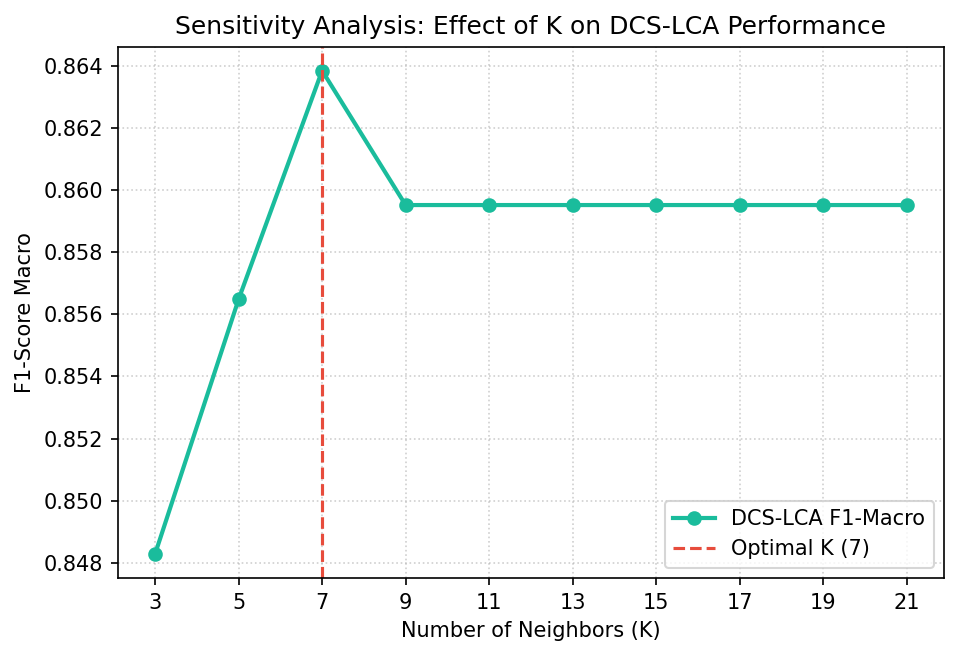
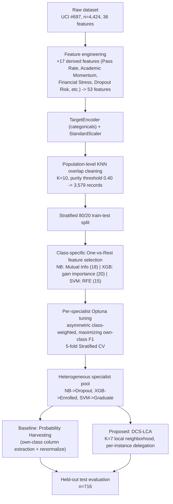

# Dynamic Classifier Selection – Local Class Accuracy (DCS-LCA) for Student Dropout Prediction

**A heterogeneous specialist-pool ensemble that replaces static soft-voting with per-instance dynamic delegation, evaluated against a Probability Harvesting baseline on the UCI Student Dropout dataset.**

📄 Full manuscript included in this repo: [`Dynamic Classifier Selection using Local Class Accuracy on Overlap Cleaned Heterogeneous Pool of Experts.pdf`](./Dynamic%20Classifier%20Selection%20using%20Local%20Class%20Accuracy%20on%20Overlap%20Cleaned%20Heterogeneous%20Pool%20of%20Experts.pdf)

---

## Abstract

Student dropout prediction on the UCI "Predict Students' Dropout and Academic Success" dataset (n = 4,424) is hard for two compounded reasons: the three outcome classes — *Dropout* (32.1%), *Enrolled* (17.9%), *Graduate* (49.9%) — are imbalanced, and they overlap heavily in feature space, especially around the *Enrolled* transition class. Global classifiers and synthetic-oversampling fixes (SMOTE/ADASYN) struggle here: 81% of the dataset's 36 raw features are nominal/binary, and linear interpolation across a binary feature produces values outside `{0, 1}`, corrupting the feature geometry it was meant to preserve.

This project builds an **augmentation-free** alternative. Instead of rebalancing the data, it rebalances the *decision process*: a heterogeneous pool of three class-specialist models (Gaussian Naive Bayes → Dropout, XGBoost → Enrolled, SVM → Graduate), each independently feature-selected and cost-sensitively tuned for its own class, is combined at inference time with **Dynamic Classifier Selection – Local Class Accuracy (DCS-LCA)**: for every test instance, the specialist with the highest local class accuracy in its K-nearest-neighbor region is delegated the final decision — one expert, one vote, chosen per instance rather than blended globally.

The proposed method is benchmarked against **Probability Harvesting**, a static baseline that builds a single probability vector by extracting each specialist's own-class column and renormalizing it — isolating the value of *dynamic per-instance selection* from the value of the specialist pool itself, since both methods share the exact same three trained specialists.

---

## Results

All metrics below are computed on the same held-out test set (n = 716, stratified 80/20 split) and are reproduced end-to-end in [`notebooks/5_comparison_result.ipynb`](./notebooks/5_comparison_result.ipynb).

### Global comparison — Probability Harvesting vs. DCS-LCA

| Metric | Baseline: Probability Harvesting | **Proposed: DCS-LCA (K=7)** | Δ |
|---|---:|---:|---:|
| Accuracy | 0.8897 | **0.9162** | +2.98% |
| Log Loss | 0.8979 | **0.2687** | **−70.08%** |
| ROC-AUC (Macro, OvR) | 0.9697 | **0.9785** | +0.91% |
| F1-Score Macro | 0.8262 | **0.8638** | +4.55% |
| F1 — Dropout | 0.8673 | **0.9130** | +5.27% |
| F1 — Enrolled | 0.6710 | **0.7261** | +8.21% |
| F1 — Graduate | 0.9404 | **0.9524** | +1.28% |

DCS-LCA wins on every metric, but the two results that matter most are the **log-loss collapse** (0.898 → 0.269) and the **Enrolled-class F1 gain** (+8.21%) — Enrolled is the smallest, most boundary-ambiguous class and the one every prior static approach sacrifices first.

### Why the log-loss gap is the real story

Probability Harvesting builds its output vector by stitching together one probability column from each specialist and renormalizing — but those three specialists were never jointly calibrated, so the stitched vector is frequently over- or under-confident in overlap zones. DCS-LCA instead *inherits* the full, self-consistent probability distribution of whichever single specialist is locally most competent, which is why its log loss (0.269) is roughly a third of the baseline's (0.898) even though accuracy only moved by ~3 points.

### Individual specialist performance (own-class F1, on full test set)

| Specialist | Target class | Feature selection | Own-class F1 | Macro F1 |
|---|---|---|:---:|:---:|
| Gaussian Naive Bayes | Dropout | Mutual Information (top 18) | 0.8585 | 0.7916 |
| XGBoost | Enrolled | XGBoost gain importance (top 20) | 0.7081 | 0.8608 |
| SVM (RBF) | Graduate | RFE w/ LinearSVC (top 15) | 0.9525 | 0.8101 |

Each specialist is genuinely a specialist: strong on its own class, mediocre elsewhere — which is exactly the diversity DCS-LCA is designed to exploit rather than average away.

### K-sensitivity of the DCS-LCA neighborhood



Macro F1 follows an inverted-U over K ∈ {3, 5, 7, 9, ..., 21} on the validation split: too few neighbors (K=3, F1=0.8483) makes local competence noisy; too many (K≥9, F1 plateaus at 0.8595) over-smooths the boundary and dilutes the benefit of dynamic selection. **K = 7 is the empirical optimum (F1 = 0.8638)** and is the value used in the final model.

### KNN overlap cleaning impact

Population-level KNN overlap cleaning (K=10, purity threshold = 0.40) removed **845 of 4,424 records (19.1%)** before any train/test split, concentrated almost entirely in the ambiguous boundary zones:

| Class | Removal rate |
|---|:---:|
| Enrolled | 53.8% |
| Dropout | 24.0% |
| Graduate | 3.5% |

This is deliberately *not* a resampling technique — no synthetic points are created, so the 81% of features that are nominal/binary keep their valid `{0, 1}` domain, and both train and test sets are drawn from the same cleaned distribution (cleaning happens before the split), avoiding the optimistic bias that comes from cleaning only the training fold.

---

## Method overview



### Phase 1 — Preprocessing
- **Feature engineering**: 17 domain-derived features (`Pass_Rate_Sem1/2`, `Academic_Momentum`, `Academic_Fatigue`, `Grade_Trend`, `Financial_Stress`, `Dropout_Risk`, etc.) computed from the raw semester-level curricular unit counts and grades (`src/feature_engineering.py`).
- **Encoding**: 9 high-cardinality categorical columns via `TargetEncoder` (smoothing λ=10); all features standardized afterward.
- **Overlap cleaning**: population-level KNN (K=10, purity ≥ 0.40) applied *before* the train/test split, so both splits are drawn from the same cleaned distribution (`src/data_cleaning.py`).

### Phase 2 — Specialist pool construction
- **Per-class feature selection** via a temporary One-vs-Rest binary reduction, using a method matched to each model's inductive bias: Mutual Information for Naive Bayes, XGBoost gain importance for XGBoost, and RFE (LinearSVC base) for SVM (`src/feature_selection.py`).
- **Asymmetric cost-sensitive tuning**: each specialist is tuned independently with Optuna, maximizing its own class-specific F1 (not macro F1) under 5-fold stratified CV, jointly searching hyperparameters *and* class-weight multipliers rather than fixing them a priori.

### Phase 3 — Ensemble aggregation (two competing strategies)
- **Probability Harvesting (baseline)**: extract each specialist's probability for its own designated class, concatenate, renormalize to sum to 1, and take the argmax (`src/models_pool.py`, `notebooks/4_probability_harvesting.ipynb`).
- **DCS-LCA (proposed)**: for each test instance, find its K=7 nearest neighbors in a held-out Dynamic Selection set (DSEL — 30% of the training split, never used to train the pool), compute each specialist's Local Class Accuracy on the subset of neighbors sharing its predicted label, and delegate the entire prediction to the single specialist with the highest LCA (`src/dcs_lca.py`, `notebooks/3_dcs_lca.ipynb`).

---

## Repository structure

```text
.
├── notebooks/
│   ├── EDA.ipynb                     # Exploratory analysis (categorical decoding, distributions)
│   ├── 1_data_preprocessing.ipynb    # Feature engineering + KNN overlap cleaning
│   ├── 2_hyperparameter_tuning.ipynb # Per-specialist OvR feature selection + Optuna tuning
│   ├── 3_dcs_lca.ipynb               # DCS-LCA implementation, K-sensitivity analysis, final export
│   ├── 4_probability_harvesting.ipynb# Static baseline construction and evaluation
│   └── 5_comparison_result.ipynb     # Head-to-head evaluation, all comparison tables/plots below
├── src/
│   ├── feature_engineering.py        # 17 derived academic/financial features
│   ├── data_cleaning.py              # Population-level KNN overlap cleaning
│   ├── feature_selection.py          # OvR feature selection (MI / XGB importance / RFE)
│   ├── models_pool.py                # FeatureSubsetWrapper for heterogeneous specialists
│   └── dcs_lca.py                    # Core DCS-LCA prediction algorithm
├── models/                           # Trained specialists, DCS-LCA pool, Probability Harvesting artifacts
├── data/
│   ├── raw/data.csv                  # UCI ML Repository #697 (n=4,424, 36 features)
│   └── processed/data_final.csv      # Post-engineering, post-cleaning (n=3,579, 53 features)
├── output/                           # All figures referenced in the paper (confusion matrices, ROC curves,
│                                      # PCA before/after cleaning, per-class F1 comparison, K-sensitivity)
└── *.docx / *.pdf                    # Full research manuscript
```

---

## Reproducing the results

```bash
pip install -r requirements.txt
```

Run the notebooks in order — each stage persists its artifacts (`data/processed/`, `models/`) for the next:

1. `1_data_preprocessing.ipynb` — builds `data/processed/data_final.csv`
2. `2_hyperparameter_tuning.ipynb` — trains and saves the three specialists + feature indices
3. `3_dcs_lca.ipynb` — runs the K-sensitivity sweep, exports `models/dcs_lca_model.pkl`
4. `4_probability_harvesting.ipynb` — builds the static baseline, exports `models/baseline_probability_harvesting.pkl`
5. `5_comparison_result.ipynb` — reproduces every table and figure in this README

---

## Limitations (as reported in the manuscript)

- The 70/30 base-train / DSEL split inside the training partition reduces the effective data available to train each specialist; cross-validation–based pool construction is a candidate future fix.
- DCS-LCA's per-instance K-nearest-neighbor lookup adds inference-time cost; spatial indexing (e.g., KD-Trees) would be needed to scale beyond this dataset's size.
- The Enrolled class remains the weakest (F1 = 0.7261) despite the largest relative gain — border ambiguity between Enrolled and its neighboring classes is reduced, not eliminated.
